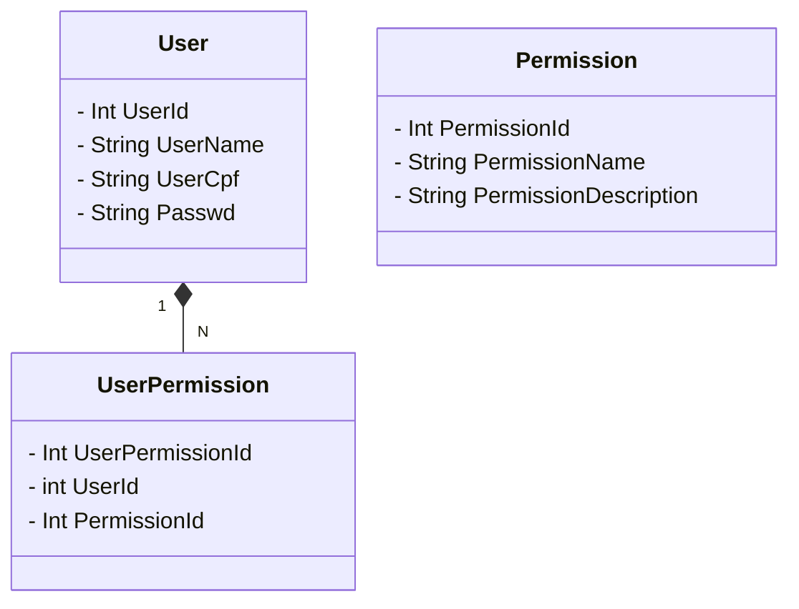

# DotNET Web API

Base project for a RESTful API web application made with .NET 7 with JWT authentication and logs. 
All CRUD methods with their respective HTTP verbs (GET, POST, PUT and PATH) were implemented for the 3 base classes of this project.

Implemented unit tests with xunit.

[](https://opensource.org/licenses/MIT)
[](https://github.com/codedthemes/mantis-free-react-admin-template/blob/main/LICENSE)

## Description
|  Stack                                         |  Description                                                      |
| ---------------------------------------------- | :---------------------------------------------------------------- |
| ✓ .NET Core 7 Web API Project Base             | ASP NET Web API Project Base                                      |
| ✓ Entity Framework 7                           | ✓ CRUD Base With 3 Class                                          |
| ✓ MySQL DB                                     | ✓ Data Context Connection DB Ajustable (For others DB`s)          |
| ✓ MongoDB                                      | ✓ For logs and token storage                                      |
| ✓ Auth Service                                 | ✓ JWT authentication                                              |
| ✓ MVC                                          | ✓ MVC Arch.                                                       |
| ✓ Serilog                                      | ✓ Make logs                                                       |
| ✓ Swagger                                      | ✓ Open API Swagger Test / Doc                                     |
| ✓ XUnit                                        | ✓ For unit tests.                                                 |

## Requeriments
-  ✓ Docker
-  ✓ Docker Compose

## Entity Relationship Diagram - DER ##




## Getting started
Clone from GitHub

```
git clone https://github.com/rohilario/dotnetwebapi.git

```
## debug/develop with hot reload
```
dotnet run --watch

```

### Compiles and minifies for production
```
docker-compose up --build -d
```

### Down and clean All
```
docker-compose down
```

## Documentation
[Dot Net Web API documentation](http://localhost/swagger)

## Special thanks
Squadra Digital

## Developed for
BootCamp Squadra Digital 2024 - Desafio Final
